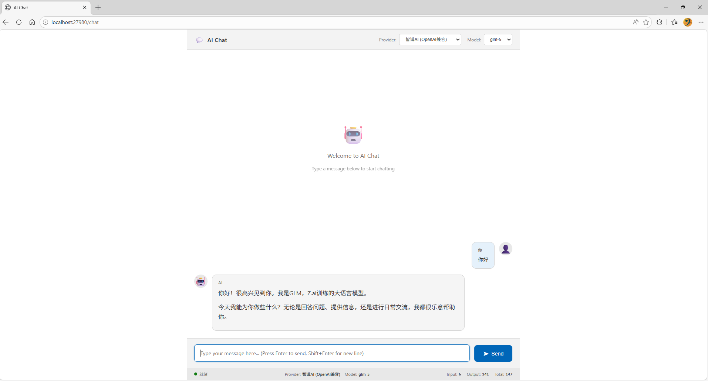
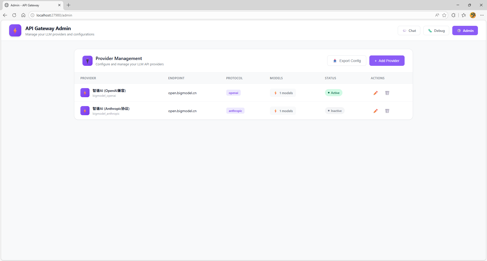
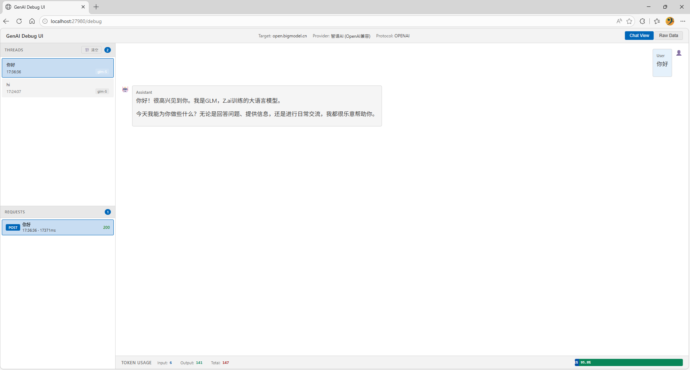

# Agent Debug Hub

一个智能体调试中心，用于监控和管理 AI 智能体与大语言模型之间的交互。支持实时查看请求/响应数据，并通过 SSE 推送实时更新。

## 功能特性

- **多供应商支持**: 支持智谱AI (BigModel)、OpenAI、Anthropic 等多个 AI 供应商
- **请求监控**: 实时记录所有 API 请求和响应
- **Token 转换**: 自动将用户 Token 替换为配置的真实 Token
- **URL 转换**: 自动将本地网关 URL 转换为目标供应商 URL
- **实时推送**: 通过 SSE (Server-Sent Events) 实时推送请求记录
- **Web 界面**: 内置调试界面、聊天界面和管理控制台
- **动态供应商路由**: 通过 URL 路径或请求头指定供应商
- **消息格式转换**: 自动在 OpenAI 和 Anthropic 格式之间转换
- **模型管理**: 支持获取和管理供应商模型列表
- **管理控制台**: 提供供应商配置管理和系统监控

## 安装

```bash
npm install
```

## 配置

编辑 `config.json` 文件配置供应商和网关设置：

```json
{
  "providers": {
    "bigmodel_openai": {
      "name": "智谱AI (OpenAI兼容)",
      "targetHost": "open.bigmodel.cn",
      "targetProtocol": "https",
      "apiToken": "your-api-token-here",
      "basePath": "/api/coding/paas/v4",
      "protocol": "openai",
      "description": "智谱AI大模型平台 (OpenAI兼容接口)",
      "models": [
        { "id": "glm-4", "name": "GLM-4" },
        { "id": "glm-4-flash", "name": "GLM-4 Flash" }
      ],
      "defaultModel": "glm-4"
    },
    "bigmodel_anthropic": {
      "name": "智谱AI (Anthropic兼容)",
      "targetHost": "open.bigmodel.cn",
      "targetProtocol": "https",
      "apiToken": "your-api-token-here",
      "basePath": "/api/anthropic",
      "protocol": "anthropic",
      "description": "智谱AI大模型平台 (Anthropic兼容接口)",
      "models": [
        { "id": "claude-3-opus-20240229", "name": "Claude 3 Opus" },
        { "id": "claude-3-sonnet-20240229", "name": "Claude 3 Sonnet" }
      ],
      "defaultModel": "claude-3-opus-20240229"
    }
  },
  "gateway": {
    "port": 27980,
    "host": "localhost",
    "maxRecords": 50
  }
}
```

### 配置说明

| 字段 | 说明 |
|------|------|
| `providers` | 供应商配置字典，键为供应商标识 |
| `providers[name]` | 供应商显示名称 |
| `providers[targetHost]` | 目标 API 域名 |
| `providers[targetProtocol]` | 协议 (http/https) |
| `providers[apiToken]` | 真实的 API Token |
| `providers[basePath]` | API 基础路径 |
| `providers[protocol]` | 协议类型 (openai/anthropic) |
| `providers[description]` | 供应商描述 |
| `providers[models]` | 可用模型列表 |
| `providers[defaultModel]` | 默认模型 |
| `gateway[port]` | 网关监听端口 |
| `gateway[host]` | 网关监听地址 |
| `gateway[maxRecords]` | 最大记录保存数量 |

## 使用方法

### 启动服务

```bash
# 构建并启动
npm start

# 开发模式
npm run dev

# 指定配置文件
node dist/server.js --config ./my-config.json
```

### 命令行参数

| 参数 | 简写 | 说明 | 默认值 |
|------|------|------|--------|
| `--config` | `-c` | 指定配置文件路径 | `config.json` |
| `--help` | `-h` | 显示帮助信息 | - |

### 动态供应商路由

供应商通过 URL 路径动态指定，格式: `/provider/api/...`

**示例**:
- `http://localhost:27980/bigmodel_openai/api/coding/paas/v4/chat/completions`
- `http://localhost:27980/bigmodel_anthropic/api/anthropic/v1/messages`

**可用的供应商**:
- `bigmodel_openai` - 智谱AI (OpenAI兼容接口)
- `bigmodel_anthropic` - 智谱AI (Anthropic兼容接口)

### API 端点

| 端点 | 方法 | 说明 |
|------|------|------|
| `/` | GET | 默认调试界面 |
| `/debug` | GET | 调试界面 |
| `/chat` | GET | 聊天界面 |
| `/chat` | POST | 发送聊天消息 |
| `/admin` | GET | 管理控制台 |
| `/api/info` | GET | 获取网关和供应商信息 |
| `/api/records` | GET | 获取所有请求记录 |
| `/api/records` | DELETE | 清空所有请求记录 |
| `/api/records/clear` | POST | 清空所有请求记录 |
| `/api/events` | GET | SSE 实时事件流 |
| `/models` | GET | 获取模型列表 |
| `/admin/config` | GET | 获取当前配置 |
| `/admin/providers` | POST | 创建新供应商 |
| `/admin/providers/:id` | DELETE | 删除供应商 |
| `/admin/providers/:id` | PUT | 更新供应商配置 |
| `/admin/providers/:id/token` | PUT | 更新供应商Token |
| `/admin/providers/:id/models` | PUT | 更新供应商模型列表 |
| `/admin/providers/:id/default-model` | PUT | 设置默认模型 |
| `/admin/providers/:id/fetch-models` | GET | 从供应商API获取模型 |
| `/*` | ALL | 代理请求到目标供应商 |

### 使用示例

```bash
# 使用 Authorization 头
curl -X POST http://localhost:27980/api/coding/paas/v4/chat/completions \
  -H "Authorization: Bearer dummy-token" \
  -H "Content-Type: application/json" \
  -d '{"model": "glm-4", "messages": [{"role": "user", "content": "Hello"}]}'

# 使用 URL 参数传递 token
curl -X POST "http://localhost:27980/api/coding/paas/v4/chat/completions?token=dummy" \
  -H "Content-Type: application/json" \
  -d '{"model": "glm-4", "messages": [{"role": "user", "content": "Hello"}]}'

# 使用动态供应商路由
curl -X POST http://localhost:27980/bigmodel_openai/api/coding/paas/v4/chat/completions \
  -H "Authorization: Bearer dummy-token" \
  -H "Content-Type: application/json" \
  -d '{"model": "glm-4", "messages": [{"role": "user", "content": "Hello"}]}'

# 使用请求头指定供应商
curl -X POST http://localhost:27980/chat \
  -H "X-Provider: bigmodel_anthropic" \
  -H "Content-Type: application/json" \
  -d '{"model": "claude-3-opus-20240229", "messages": [{"role": "user", "content": "Hello"}]}'

# 使用查询参数指定供应商
curl -X POST "http://localhost:27980/chat?provider=bigmodel_openai" \
  -H "Content-Type: application/json" \
  -d '{"model": "glm-4", "messages": [{"role": "user", "content": "Hello"}]}'
```

## 开发

### 构建

```bash
npm run build
```

### 测试

```bash
# 运行测试
npm test

# 运行测试并生成覆盖率报告
npm run test:coverage

# 监听模式
npm run test:watch
```

### 项目结构

```
agent-debug-hub/
├── src/
│   ├── server.ts          # 主服务器入口
│   ├── config.ts          # 配置管理
│   ├── url-transformer.ts # URL 转换器
│   ├── types.ts           # 类型定义
├── tests/
│   ├── config.test.ts     # 配置管理测试
│   └── url-transformer.test.ts # URL 转换器测试
├── public/
│   ├── index.html         # 调试界面
│   ├── chat.html          # 聊天界面
│   └── admin.html         # 管理控制台
├── pics/
│   ├── chat.png           # Chat页面截图
│   ├── admin.png          # Admin页面截图
│   └── debug.png          # Debug页面截图
├── config.json            # 配置文件
├── package.json
├── tsconfig.json
└── jest.config.js
```

## 核心模块

### ConfigManager

配置管理器，负责加载和管理供应商配置。

```typescript
import { ConfigManager, initializeConfig } from './config';

// 初始化配置
const configManager = initializeConfig('config.json');

// 获取供应商配置
const providerConfig = configManager.getProviderConfig();

// 获取指定供应商配置
const openaiConfig = configManager.getProviderConfig('bigmodel_openai');

// 获取网关配置
const gatewayConfig = configManager.getGatewayConfig();

// 获取可用供应商列表
const providers = configManager.getAvailableProviders();

// 获取当前供应商
const currentProvider = configManager.getCurrentProvider();

// 验证供应商
const isValid = configManager.validateProvider('bigmodel_anthropic');

// 添加新供应商
configManager.addProvider('new_provider', {
  name: 'New Provider',
  targetHost: 'api.newprovider.com',
  targetProtocol: 'https',
  apiToken: 'api-token-here',
  basePath: '/v1',
  protocol: 'openai'
});

// 更新供应商
configManager.updateProvider('new_provider', {
  name: 'Updated Provider'
});

// 更新供应商Token
configManager.updateProviderToken('new_provider', 'new-token-here');

// 更新供应商模型
configManager.updateProviderModels('new_provider', [{ id: 'model-1', name: 'Model 1' }]);

// 设置默认模型
configManager.setDefaultModel('new_provider', 'model-1');

// 删除供应商
configManager.removeProvider('new_provider');
```

### UrlTransformer

URL 转换器，负责将网关 URL 转换为目标供应商 URL。

```typescript
import { UrlTransformer } from './url-transformer';

const transformer = new UrlTransformer(configManager);

// 转换请求
const transformed = transformer.transformRequest('http://localhost:27980/api/test', {
  'Authorization': 'Bearer dummy-token'
});

// 获取当前供应商信息
const providerInfo = transformer.getCurrentProviderInfo();
```

## 安全注意事项

- **不要提交真实 Token**: `config.json` 中的 API Token 应该添加到 `.gitignore`
- **本地使用**: 此网关设计用于本地开发和调试，不建议在生产环境使用
- **Token 保护**: 真实 Token 仅存储在服务端，客户端使用任意 Token 即可
- **访问控制**: 管理控制台没有访问控制，仅在本地使用

## 启动信息

服务启动后会显示以下信息：

```
========================================
API Gateway Monitor v2.0 已启动
========================================
网关地址: http://localhost:27980
监控界面: http://localhost:27980/debug
API信息:  http://localhost:27980/api/info
----------------------------------------
使用示例:
  curl -H "Authorization: Bearer dummy" http://localhost:27980/api/coding/paas/v4/chat/completions
  curl http://localhost:27980/api/coding/paas/v4/chat/completions?token=dummy
========================================
```

## 界面展示

以下是项目的三个关键页面截图，展示了主要功能和用户界面：

### Chat 页面

- **功能**：提供AI聊天交互界面
- **特点**：支持消息输入、对话历史显示、响应实时更新
- **适用场景**：用户与AI模型的直接对话交互

### Admin 页面

- **功能**：管理控制台和配置界面
- **特点**：供应商管理、配置编辑、系统状态监控
- **适用场景**：系统管理员进行配置管理和监控

### Debug 页面

- **功能**：请求监控和调试界面
- **特点**：实时请求记录、响应数据查看、API调用分析
- **适用场景**：开发人员调试API调用和查看请求详情

## License

MIT
